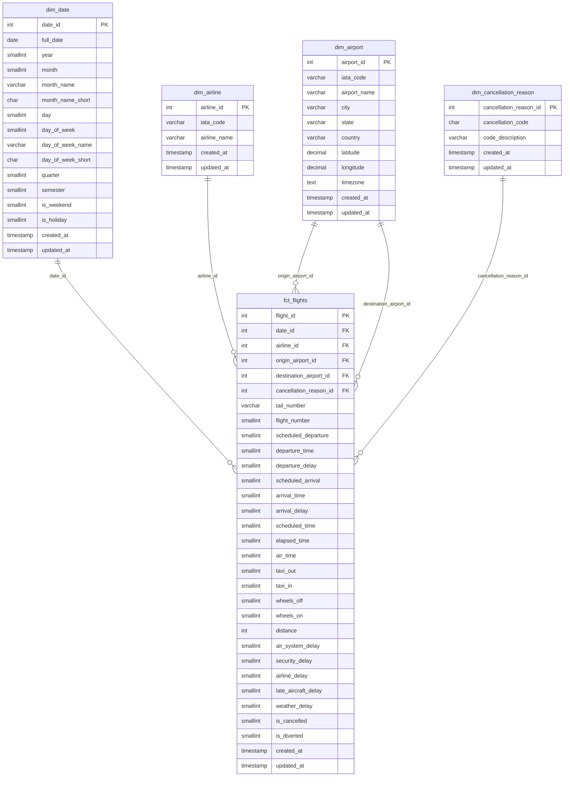

# Star Schema — Flight Delays Analysis

---

## Notes

- `dim_airport` is a **role-playing dimension** — it connects to `fct_flights` twice: once as origin airport and once as destination airport.
- `cancellation_reason_id` is **nullable** — only populated when `is_cancelled = 1`.
- `date_id` uses `YYYYMMDD` integer format (e.g. `20150115`).
