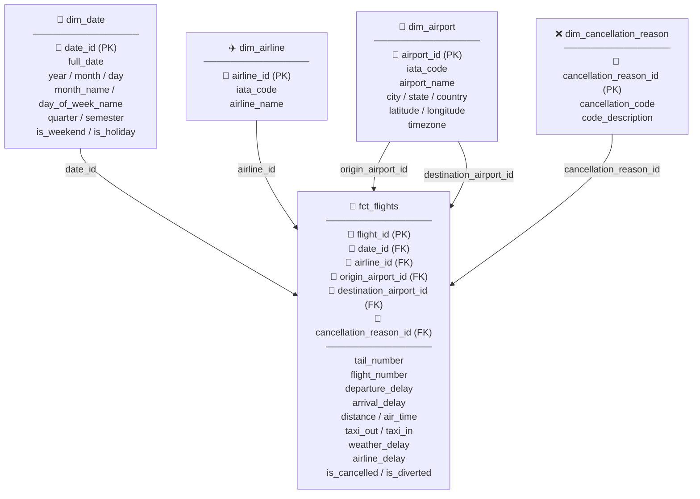

# Star Schema — Flight Delays Analysis

---

## Notes

- `dim_airport` is a **role-playing dimension** — connects to `fct_flights` twice: as origin and as destination airport.
- `cancellation_reason_id` is **nullable** — only populated when `is_cancelled = 1`.
- `date_id` uses `YYYYMMDD` integer format (e.g. `20150115`).
